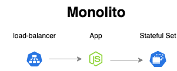
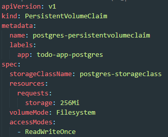

# Laboratorio Módulo 2 - Orquestación

## Ejercicio 2

### Monolito

Construir los distintos recursos de Kubernetes para generar un clúster, como el de la siguiente imagen:



### Para ello seguir los siguientes pasos:

### Paso 1. Crear una capa de persistencia de datos

Crear un `StatefulSet` para tener una base de datos dentro del cluster, para ello generar los siguientes recursos: 

* Crear un `ConfigMap` con la configuración necesaria de base de datos
* Crear un `StorageClass` para el aprovisionamineto dinámico de los recursos de persistencia
* Crear un `PersistentVolume` que referencie el `StorageClass` anterior
* Crear un `PersistentVolumeClaim` que referencie el `StorageClass` anterior
* Crear un `Cluster IP service`, de esta manera los pods del `Deployment` anterior serán capaces de llegar al `StatefulSet`
* Crear el `StatefulSet` alimentando las variables de entorno y el volumen haciendo referencia al `PersistentVolumeClaim` creado anteriormente.

Una vez tengamos nuestro `StatefulSet` corriendo la manera más directa de generar la base de datos sería:

* Ejecutamos `kubectl get pods`, y obtenemos el nombre del pod relacionado con el `StatefulSet`.
* Ejecutamos `kubectl exec [postgres-pod-name] -it bash`
* Ejecutamos `psql -U postgres`, pegamos `todo-app/todos_db.sql` y pulsamos `enter`, la base de datos debería estar generada

### Solución
#### Crear carpeta manifests\postgres para incluir los archivos .yaml
```bash
mkdir manifests
cd manifests
mkdir postgres
```

#### 1. Crear un ConfigMap con la configuración necesaria de base de datos


#### Ejecutar cambios
```bash
kubectl apply -f manifests/postgres/postgres-configmap.yaml
```
#### Comprobar
```bash
kubectl get configmap
```


#### 2. Crear un StorageClass para el aprovisionamineto dinámico de los recursos de persistencia


#### Ejecutar cambios
```bash
kubectl apply -f manifests/postgres/postgres-storageclass.yaml
```
#### Comprobar
```bash
kubectl get storageclass
```

			
#### 3. Crear un PersistentVolume que referencie el StorageClass anterior


#### Ejecutar cambios
```bash
kubectl apply -f manifests/postgres/postgres-persistentvolume.yaml
```
#### Comprobar
```bash
kubectl get pv
```


#### 4. Crear un PersistentVolumeClaim que referencie el StorageClass anterior


#### Ejecutar cambios
```bash
kubectl apply -f manifests/postgres/postgres-persistentvolume-claim.yaml
```

#### Comprobar
```bash
kubectl get pvc
```


#### 5. Crear un Cluster IP service, de esta manera los pods del Deployment anterior serán capaces de llegar al StatefulSet


#### Ejecutar cambios
```bash
kubectl apply -f manifests/postgres/postgres-service.yaml
```

#### Comprobar
```bash
kubectl get svc
```


### 6. Crear el StatefulSet alimentando las variables de entorno y el volumen haciendo referencia al PersistentVolumeClaim creado anteriormente


#### Ejecutar cambios
```bash
kubectl apply -f manifests/postgres/postgres-statefulset.yaml
```

#### Comprobar
```bash
kubectl get statefulset
```


* Ejecutamos `kubectl get pods`, y obtenemos el nombre del pod relacionado con el `StatefulSet`.
```bash
kubectl get pods
```


* Ejecutamos `kubectl exec [postgres-pod-name] -it bash`
```bash
kubectl exec postgres-statefulset-0 -it bash
```
* Ejecutamos `psql -U postgres`, pegamos `todo-app/todos_db.sql` y pulsamos `enter`, la base de datos debería estar generada
#### Comprobar que la BBDD contiene registros


### Paso 2. Crear todo-app

Crear un `Deployment` para `todo-app`, usar el `Dockerfile` de este direetorio **todo-app**, para generar la imagen necesaria.

Al ejecutar un contenedor a partir de la imagen anterior, el puerto por defecto es el 3000, pero se lo podemos alimentar a partir de  variables de entorono, las variables de entorno serían las siguientes

* **NODE_ENV** : El entorno en que se está ejecutando el contenedor, nos vale cualquier valor que no sea `test`
* **PORT** : El puerto por el que va a escuchar el contenedor
* **DB_HOST** : El host donde se encuentra la base de datos
* **DB_USER**: El usuario que accede a la base de datos, podemos usar el de por defecto `postgres`
* **DB_PASSWORD**: El password para acceeder a la base de datos, podemos usar el de por defecto `postgres`
* **DB_PORT** : El puerto en el que postgres escucha `5432`
* **DB_NAME** : El nombre de la base de datos, en `todo-app/todos_db.sql`, el script de inicialización recibe el nombre de `todos_db`
* **DB_VERSION** : La versión de postgres a usar, en este caso `10.4`

Crear un `ConfigMap` con todas las variables de entorno, que necesitarán los pods de este `Deployment`.

> NOTA: Las obligatorias son las de la base de datos, todas aquellas que comienzan por `DB`

### Solución
#### Crear carpeta manifests\todo-app para incluir los archivos .yaml
```bash
cd manifests
mkdir todo-app
```

#### Crear archivo todo-app-configmap.yaml


#### Crear archivo manifests/todo-app/todo-app-deployment.yaml


#### Crear archivo manifests/todo-app/todo-app-service.yaml


#### Desplegar estando ubicados en la ruta /01-monolith/manifests
    kubectl apply -f todo-app


#### Comprobar balanceador creado con el deployment
	kubectl get pods


#### Comprobar endpoints
	kubectl get endpoints


#### Ejecutar el siguiente comando
	minikube tunnel

#### Chequear la IP externa
	kubectl get svc


#### Acceder a la aplicación
	http://127.0.0.1:4000


### Paso 3. Acceder a todo-app desde fuera del clúster

Crear un `LoadBalancer service` para acceder al `Deployment` anteriormente creado desde fuera del clúster. Para poder utilizar un `LoadBalancer` con minikube seguir las instrucciones de este [artículo](https://minikube.sigs.k8s.io/docs/handbook/accessing/)

    La solución a este paso está descrita en el punto 5. Crear un Cluster IP service, de esta manera los pods del Deployment anterior serán capaces de llegar al StatefulSet del paso anterior
