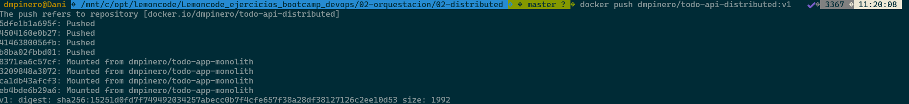

# Ingress

## Enunciado

Construir los distintos recursos de Kubernetes para generar un clúster, como el de la siguiente imagen:


### Para ello seguir los siguientes pasos:

### Paso 0. Crear imágenes y comprobar solución con Docker.

### Solución

#### X. Crear imagen todo-api
```bash
docker build -f todo-api/Dockerfile -t dmpinero/todo-api-distributed:v1 todo-api/
```


#### X. Subir imagen todo-api a repositorio github
```bash
docker push dmpinero/todo-api-distributed:v1
```


#### X. Arrancar contenedor en base a la imagen creada
```bash
docker run -d -p 3000:3000 \
-e NODE_ENV=production \
-e PORT=3000 \
--name todo-api-distributed \
dmpinero/todo-api-distributed:v1
```

#### X. Crear archivo .env dentro de la carpeta 02-distributed\todo-front\src


##### El contenido del archivo todo-front.env.production es


#### X. Crear archivo .env dentro de la carpeta 02-distributed\todo-front\src


##### El contenido del archivo todo-front.env.production es


#### X. Crear imagen todo-front
```bash
docker build -f todo-front/Dockerfile -t dmpinero/todo-front-distributed:v1 todo-front/
```


#### X. Subir imagen todo-api a repositorio github
```bash
docker push dmpinero/todo-front-distributed:v1
```


#### X. Arrancar contenedor en base a la imagen creada
```bash
docker build --build-arg="API_HOST=http://localhost:3000" -f todo-front/Dockerfile -t dmpinero/todo-front-distributed:v1 todo-front/
```

#### X. Comprobar que las imágenes están creadas
```bash
docker image ls | grep "[^c]distributed"
```


#### Acceder a http://localhost:8081 en un navegador y añadir algunas tareas


#### Acceder a http://localhost:3000 en un navegador y recuerar vía API las tareas creadas


### Paso 1. Crear todo-front.

Crear un `Deployment` para `todo-front`, usar el `Dockerfile` de este directorio **02-distributed/todo-front**, para generar la imagen necesaria. Notar que existe `ARG API_HOST` dentro del fichero `Dockerfile`, lo podemos omitir en este caso, sólo está ahí para poder probar el contenedor de Docker en local.

Al ejecutar un contenedor a partir de la imagen anterior, el puerto expuesto para http es el 80. 

Crear un `Cluster IP Service` que exponga `todo-front` dentro del clúster.

### Solución

#### Crear carpeta manifests para incluir los archivos .yaml
```bash
mkdir manifests
cd manifests
```

#### Para conectar Frontend y Backend construir la imagen dmpinero/todo-front-distributed:v2 image con la ejecución del siguiente comando
```bash
$ cd todo-front
$ docker build --build-arg="API_HOST=http://lc.todo.info" -t dmpinero/todo-front-distributed:v2 .
Subir al repositorio de Docker Hub la imagen creada: $ docker push dmpinero/todo-front-distributed:v2
```


#### Arrancar cluster minikube y habilitar NGINX Ingress controller
```bash
$ minikube start
$ minikube addons enable ingress
$ minikube addons enable minikube addons enable ingress-dns
```


#### X. Crear namespace


#### X. Crear deployment para todo-front


#### X. Crear service para todo-front


### Paso 2. Crear todo-api.

Crear un `Deployment` para `todo-api`, usar el `Dockerfile` de este directorio **02-distributed/todo-api**, para generar la imagen necesaria.

Al ejecutar un contenedor a partir de la imagen anaterior, el puerto por defecto es el 3000, pero se lo podemos alimentar a partir de  variables de entorono, las variables de entorno serían las siguientes

* **NODE_ENV** : El entorno en que se está ejecutando el contenedor, nos vale cualquier valor que no sea `test`
* **PORT** : El puerto por el que va a escuchar el contenedor

(_Opcional_) Crear un `ConfigMap` que exponga las variables de entorno anteriores. 

Crear un `Cluster IP Service` que exponga `todo-api` dentro del clúster.

### Solución

#### X. Crear configmap para todo-api
 

#### X. Crear deployment para todo-api
 

#### X. Crear service para todo-api


### Paso 3. Crear un Ingress para acceder a los servicios del clúster
Crear un `Ingress` para exponer los servicios anteriormente creados. Como referencia para crear este controlardor con `minikube` tomar como referencia el siguiente ejemplo [Set up Ingress on Minikube with the NGINX Ingress Controller](https://kubernetes.io/docs/tasks/access-application-cluster/ingress-minikube/)

### Solución


#### X. Desplegar
  kubectl apply -f .


#### X. Verificar despliegue
```bash
kubectl get -f .
```


#### X. Verificar pods
```bash
kubectl get pods
```


#### X. Verificar que el servicio todo-app-api-service está creado y disponible en el node port
```bash
kubectl get service todo-app-api-service
```


#### Acceder al servicio todo-app-api-service vía NodePort
```bash
minikube service todo-app-api-service
```
