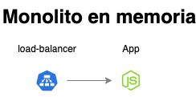

# Laboratorio Módulo 3 - Orquestación
## Ejercicio 1

### Monolito en memoria
Construir los distintos recursos de Kubernetes para generar un clúster, como el de la siguiente imagen:



### Para ello seguir los siguientes pasos:

### Paso 1. Crear todo-app

Crear un `Deployment` para `todo-app`, usar el `Dockerfile` de este direetorio **todo-app**, para generar la imagen necesaria.

Al ejecutar un contenedor a partir de la imagen anaterior, el puerto por defecto es el 3000, pero se lo podemos alimentar a partir de  variables de entorono, las variables de entorno serían las siguientes

* **NODE_ENV** : El entorno en que se está ejecutando el contenedor, nos vale cualquier valor que no sea `test`
* **PORT** : El puerto por el que va a escuchar el contenedor.

### Solución
Crear imagen de la aplicación estando ubicados en la ruta 00-monolith-in-mem

```bash
docker build -f todo-app/Dockerfile -t dmpinero/todo-app-monolith-in-mem todo-app/
```

Comprobar que la imagen se ha creado correctamente
```bash
  docker image ls | grep todo-app-monolith-in-mem
```
Levantar aplicación

```bash
docker run -d -p 3000:3000 \
  -e NODE_ENV=production \
  -e PORT=3000 \
  dmpinero/todo-app-monolith-in-mem
```

Acceder a la aplicación y verificar que funciona
```bash
http://localhost:3000
```


Subir imagen al repositorio
```bash
docker push dmpinero/todo-app-monolith-in-mem
```


Comprobar que la imagen se ha subido al espacio del usuario de la cuenta de Docker
imagen_en_repositorio_docker_hub.png


Crear carpeta manifests para incluir los archivos .yaml
```bash
mkdir manifests
```

Dentro de la carpeta manifests poner archivo todo-app-deployment.yaml con el siguiente contenido
```yaml
apiVersion: apps/v1
kind: Deployment
metadata:
  name: todo-app
spec:
  selector:
    matchLabels:
      app: todo-app
  template:
    metadata:
      labels:
        app: todo-app
    spec:
      containers:
      - name: todo-app
        image: dmpinero/todo-app-monolith-in-mem
        env:
          - name: NODE_ENV
            value: "development"
          - name: PORT
            value: "3000"
```

Aplicar cambios
```bash
kubectl apply -f todo-app-deployment.yaml
```


Verificar que el pod creado es correcto
```bash
kubectl get pods -l app=todo-app
```


Verificar que el deployment creado es correcto
```bash
kubectl get deployment
```

Hacer port-forwarding para redirigir las peticiones al pod
```bash
kubectl port-forward deployment/todo-app 3000
```


Acceder a la aplicación


También se ha comprobado el acceso mediante busybox

Crear pod para busybox
```bash
kubectl run bb --image busybox -it --restart=Never --rm
```


Obtener ip del pod
```bash
kubectl get pods -o wide -l app=todo-app
```


Acceder a la página de la aplicación y verificar que obtenemos el status 200 OK
```bash
wget -O- -S http://10.244.0.105:3000
```


### Paso 2. Acceder a todo-app desde fuera del clúster

Crear un `LoadBalancer service` para acceder al `Deployment` anteriormente creado desde fuera del clúster. Para poder utilizar un `LoadBalancer` con minikube seguir las instrucciones de este [artículo](https://minikube.sigs.k8s.io/docs/handbook/accessing/)

### Solución
Crear archivo todo-app-service.deployment.yaml dentro de carpeta manifests

Aplicar cambios
```bash
kubectl apply -f todo-app-service.yaml
```


Comprobar endpoint creado
```bash
kubectl get endpoints
```


Comprobar servicio creado
```bash
kubectl get service todo-app-service
```


Sin el tunel de minikube la ip externa (EXTERNAL-IP) aparece como pending, para obtener una ip para acceder al balanceador ejecutar en otro terminal el siguiente comando
```bash
minikube tunnel
```


Acceder a la aplicación
```bash
http://127.0.0.1:8080
```
